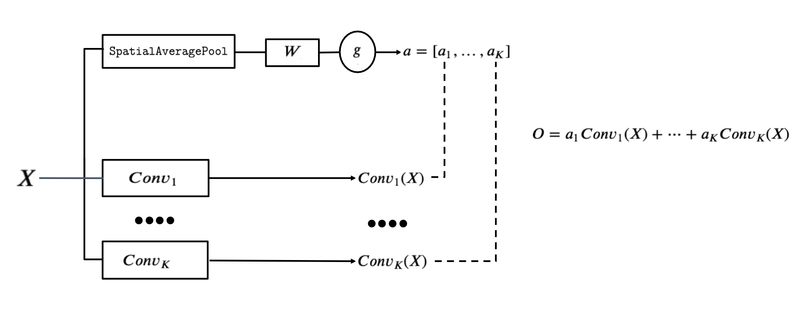
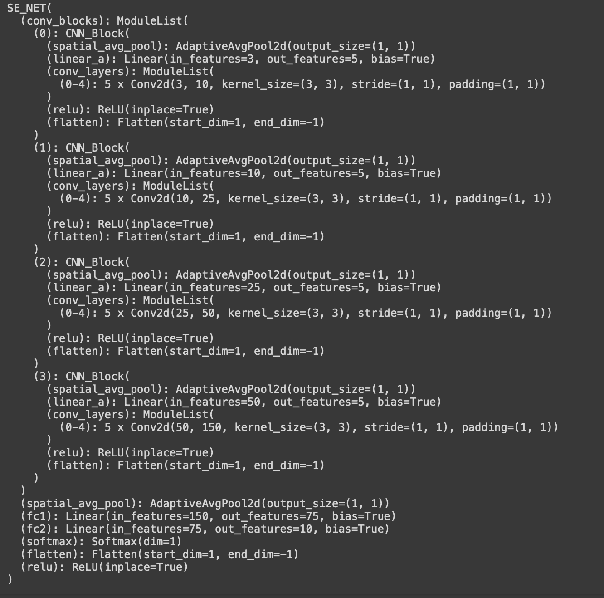
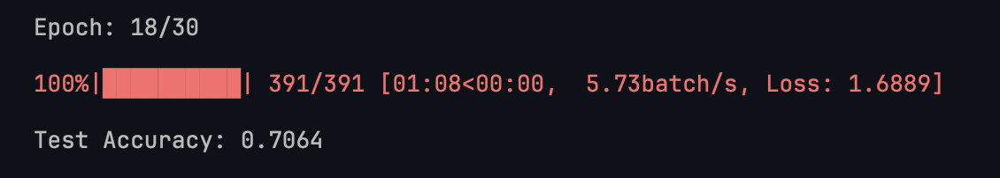
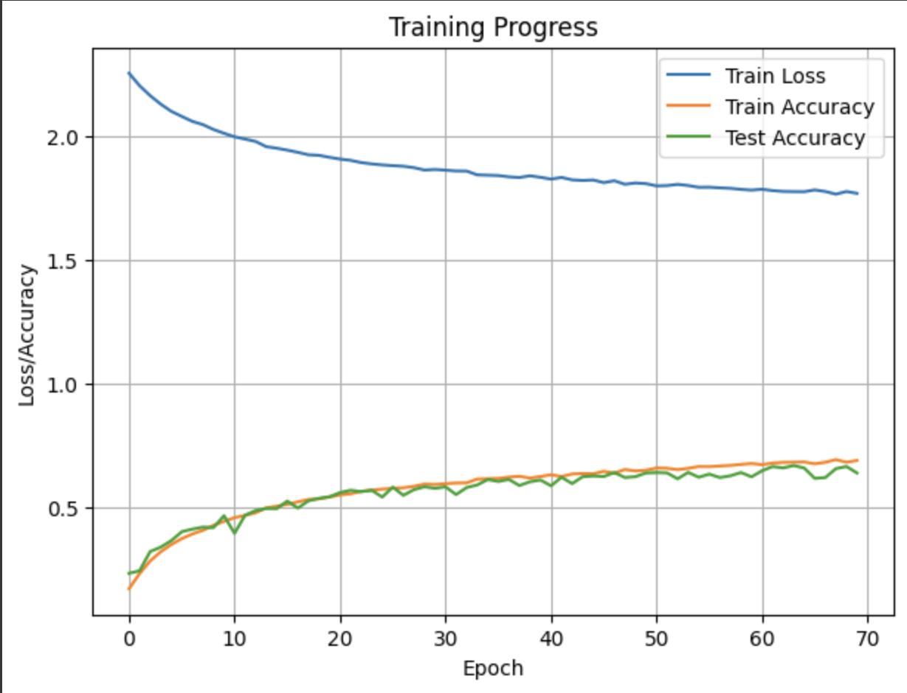

# CIFAR-10 Image Classification with a pseudo-SE_NET Architecture

### Introduction
This repo is part of the report that explores the image classification 
on the CIFAR-10 dataset using a convolutional neural network (CNN) architecture 
inspired by Squeeze-and-Excitation Networks (SE-NET). The report details the 
CIFAR-10 dataset, the implemented SE-NET architecture with its hyperparameters, 
and the potential benefits of using SE-NET for image classification tasks.

### CIFAR-10 Dataset
The CIFAR-10 dataset is a widely used benchmark for image classification tasks. 
It consists of 60,000 32x32 pixel colour images from 10 object categories, 
with 50,000 images for training and 10,000 images for testing. The dataset is 
known for its small size and balanced class distribution, making it suitable 
for evaluating and comparing different image classification algorithms.

### SE-NET Architecture
The implemented model is loosely based on the SE-NET architecture, 
which introduces a squeeze-and-excitation (SE) block to improve feature 
representation in CNNs. Each block applies multiple convolution layers 
in parallel to the input. These outputs are then scaled by an appropriate
value predicted by a linear layer. Intuitively what happens under the hood is 
that the linear layer determines the importance of a particular convolutional 
layer. This potentially could lead to better performance compared to standard 
CNN architectures.

### Model Architecture Details
The SE-NET implementation for CIFAR-10 classification consists of the following components:
- Convolutional Blocks: The model utilizes a sequence of convolutional blocks, each containing convolutional layers, followed by a ReLU activation function. This initial processing extracts spatial features from the input images. In our case 5 convolutions per block are picked
- Linear layer processing: Here 2 operations are performed. First, a global average pooling operation squeezes the image dimensions from 3x32x32 values to 3x1x1 values. These are then fed into a linear layer which after applying an activation function gives back 5 values, each per every convolution in our block. These values are used to rescale the feature maps obtained from the convolutions. In essence, we highlight important channels and suppress less informative ones.
- Adaptive Average Pooling: A global adaptive average pooling layer is applied after the final convolutional block to reduce the feature maps so they are suitable for feeding into 2 fully connected layers.
- Fully-Connected Layers: Two fully-connected layers are used for classification. The first layer transforms the flattened features into a lower-dimensional space, followed by the final layer with the number of neurons equal to the number of classes (10 for CIFAR-10).
- Softmax Layer: A softmax layer is applied at the end to convert the output logits into class probabilities, enabling multi-class classification.

### Hyperparameters
The following hyperparameters were chosen for the SE-NET implementation:
- Learning Rate: This hyperparameter controls the step size during gradient descent optimisation. After a few runs learning rate of `0.001` was determined to be the most optimal one.
- Batch Size: Here I picked a `batch size of 128` which seemed to offer the best training time to accuracy out of all the tests that I conducted.
- Number of Convolutional Blocks: The model employs four convolutional blocks, each with a configurable number of convolutional layers. This allows for experimentation with the model's capacity for feature extraction.
- Number of Filters: The number of filters in each convolutional layer determines the complexity of the features learned. In the end, I settled for these output channel configurations: `channel_configs = [10, 25, 50, 150]`
- Optimizer: In multiple runs conducted `Adam optimiser` which tends to be quite popular in many domains proved to be superior to the Stochastic Gradient Decent. It decreased the loss faster.
- Number of epochs, due to time constraints in the collab notebook 30 epochs achieved a satisfactory accuracy rate

### Results: Accuracy of 70.64% after 100 epochs

### Conclusion
The results for image classification on the CIFAR-10 dataset are presented in the report are promising.
Further experimentation would be required to evaluate the model's performance on the dataset and compare it to other architectures. 
Tuning hyperparameters like the number of convolutional blocks, filters, and learning rate can further optimize performance. 
With more computing power my current implementation would scale quite well as it only requires specifying the number of blocks, 
convulsions and output channels. The framework is also very elastic and allows for a rapid development of new models with little manual work. 
